# 선택 분기 다이어그램

## 전체 선택 분기 구조

```mermaid
flowchart TD
    Start([게임 시작]) --> C1S1[Chapter 1 Scene 1]
    C1S1 --> C1S2[Chapter 1 Scene 2]
    C1S2 --> C1S3[Chapter 1 Scene 3]
    C1S3 --> C1S4_Intro[Chapter 1 Scene 4<br/>편의점 선택지]
    
    %% Chapter 1 Scene 4 - 편의점 선택지
    C1S4_Intro -->|솔의 눈<br/>호감도 +2| C1S4_Sol[Chapter 1 Scene 4<br/>Branch A: 솔의 눈]
    C1S4_Intro -->|숙취해소제<br/>호감도 +1| C1S4_Drink[Chapter 1 Scene 4<br/>Branch B: 숙취해소제]
    C1S4_Intro -->|초코우유<br/>호감도 +0| C1S4_Milk[Chapter 1 Scene 4<br/>Branch C: 초코우유]
    
    C1S4_Sol --> C1S4_Table[Chapter 1 Scene 4<br/>테이블 대화]
    C1S4_Drink --> C1S4_Table
    C1S4_Milk --> C1S4_Table
    
    C1S4_Table --> C1S4_Outro[Chapter 1 Scene 4<br/>2차 회식 선택지]
    
    %% Chapter 1 Scene 4 Outro - 2차 회식 선택지
    C1S4_Outro -->|간다<br/>호감도 +1| C1S5_Party[Chapter 1 Scene 5<br/>2차 회식 - 파티]
    C1S4_Outro -->|안 간다| C1S5_Dorm[Chapter 1 Scene 5<br/>기숙사]
    
    C1S5_Party --> C1S5_Game[미니게임<br/>카드 게임]
    C1S5_Game -->|승리| C1S5_PartyWin[Chapter 1 Scene 5<br/>파티 승리]
    C1S5_Game -->|패배| Ending1[Ending Scene 1]
    C1S5_PartyWin --> C1S5_Debug[Chapter 1 Scene 5<br/>Debug]
    C1S5_Dorm --> C1S5_Debug
    
    C1S5_Debug --> C2S1[Chapter 2 Scene 1]
    C2S1 --> C2S2[Chapter 2 Scene 2<br/>카톡 선택지]
    
    %% Chapter 2 Scene 2 - 카톡 선택지
    C2S2 -->|죽 배달<br/>도희 +2, 지수 -1| C2S2_Dohee[Chapter 2 Scene 2<br/>Branch A: 죽 배달]
    C2S2 -->|몸 관리 좀 잘하지| C2S2_Bad[Chapter 2 Scene 2<br/>Branch B: 나쁜 선택]
    C2S2 -->|안 보낸다<br/>세라 +1| C2S2_Sera[Chapter 2 Scene 2<br/>Branch C: 무시]
    
    C2S2_Dohee --> C2S3[Chapter 2 Scene 3<br/>세라와의 선택지]
    C2S2_Bad --> C2S3
    C2S2_Sera --> C2S3
    
    %% Chapter 2 Scene 3 - 세라와의 선택지
    C2S3 -->|가방끈 놓기<br/>세라 +1| C2S3_Result1[Chapter 2 Scene 3<br/>Result 1: 당황/사과]
    C2S3 -->|팩트 폭력<br/>세라 +1| C2S3_Result2[Chapter 2 Scene 3<br/>Result 2: 팩트 폭력]
    C2S3 -->|소심한 직구<br/>세라 +2| C2S3_Result3[Chapter 2 Scene 3<br/>Result 3: 소심한 직구]
    
    C2S3_Result1 --> C2S4[Chapter 2 Scene 4<br/>Deadlock 선택지]
    C2S3_Result2 --> C2S4
    C2S3_Result3 --> C2S4
    
    %% Chapter 2 Scene 4 - Deadlock 선택지
    C2S4 -->|지수 도와주기<br/>지수 +1, 세라 -1| C2S4_Jisoo[Chapter 2 Scene 4<br/>Case 1: 지수 도와주기]
    C2S4 -->|세라와 마무리<br/>세라 +1, 지수 -1| C2S4_Sera[Chapter 2 Scene 4<br/>Case 2: 세라와 마무리]
    
    C2S4_Jisoo --> C3S1[Chapter 3 Scene 1]
    C2S4_Sera --> C3S1
    
    C3S1 --> C3S2[Chapter 3 Scene 2<br/>저녁 선택지]
    
    %% Chapter 3 Scene 2 - 저녁 선택지
    C3S2 -->|지수와 먹는다<br/>지수 +1, 도희 -1| C3S2_Jisoo[Chapter 3 Scene 2<br/>Branch A: 지수]
    C3S2 -->|도희와 먹는다<br/>도희 +1, 지수 -1| C3S2_Dohee[Chapter 3 Scene 2<br/>Branch B: 도희]
    C3S2 -->|셋이 같이 먹는다<br/>도희 -1, 지수 -1| C3S2_Together[Chapter 3 Scene 2<br/>Branch C: 셋이 같이]
    
    C3S2_Jisoo --> C3S2_JisooMenu[Chapter 3 Scene 2<br/>지수 메뉴]
    C3S2_JisooMenu --> C3S2_JisooAfter[Chapter 3 Scene 2<br/>지수 After]
    C3S2_Dohee --> C3S2_DoheeAfter[Chapter 3 Scene 2<br/>도희 After]
    C3S2_Together --> C3S2_TogetherAfter[Chapter 3 Scene 2<br/>Together After]
    
    C3S2_JisooAfter --> C4S1[Chapter 4 Scene 1<br/>자리 선택지]
    C3S2_DoheeAfter --> C4S1
    C3S2_TogetherAfter --> C4S1
    
    %% Chapter 4 Scene 1 - 자리 선택지
    C4S1 -->|앞줄 세라 옆<br/>세라 +1| C4S1_Sera[Chapter 4 Scene 1<br/>Branch A: 세라 옆]
    C4S1 -->|뒷줄 도희 옆<br/>도희 +1| C4S1_Dohee[Chapter 4 Scene 1<br/>Branch B: 도희 옆]
    
    C4S1_Sera --> C4S2[Chapter 4 Scene 2<br/>나가기 선택지]
    C4S1_Dohee --> C4S2
    
    %% Chapter 4 Scene 2 - 나가기 선택지
    C4S2 -->|나간다| C4S2_BadEnding[Chapter 4 Scene 2<br/>Bad Ending]
    C4S2 -->|안 나간다| C4S2_TrueRoute[Chapter 4 Scene 2<br/>True Route]
    
    C4S2_TrueRoute --> C4S3[Chapter 4 Scene 3<br/>최종 선택지]
    
    %% Chapter 4 Scene 3 - 최종 선택지
    C4S3 -->|도희| C4S4_DoheeIntro[Chapter 4 Scene 4<br/>도희 Intro]
    C4S3 -->|지수| C4S4_JisooIntro[Chapter 4 Scene 4<br/>지수 Intro]
    C4S3 -->|세라| C4S4_SeraIntro[Chapter 4 Scene 4<br/>세라 Intro]
    
    C4S4_DoheeIntro --> C4S4_Dohee[Chapter 4 Scene 4<br/>도희 엔딩]
    C4S4_JisooIntro --> C4S4_Jisoo[Chapter 4 Scene 4<br/>지수 엔딩]
    C4S4_SeraIntro --> C4S4_Sera[Chapter 4 Scene 4<br/>세라 엔딩]
    
    C4S4_Dohee --> EndDohee([도희 엔딩])
    C4S4_Jisoo --> EndJisoo([지수 엔딩])
    C4S4_Sera --> EndSera([세라 엔딩])
    C4S2_BadEnding --> EndBad([Bad Ending])
    Ending1 --> EndGameOver([Game Over])
    
    style C1S4_Intro fill:#e1f5ff
    style C1S4_Outro fill:#e1f5ff
    style C2S2 fill:#e1f5ff
    style C2S3 fill:#e1f5ff
    style C2S4 fill:#e1f5ff
    style C3S2 fill:#e1f5ff
    style C4S1 fill:#e1f5ff
    style C4S2 fill:#e1f5ff
    style C4S3 fill:#e1f5ff
    
    style C1S4_Sol fill:#90ee90
    style C2S3_Result3 fill:#90ee90
    style C4S2_TrueRoute fill:#90ee90
    
    style C1S4_Milk fill:#ffb6c1
    style C2S2_Bad fill:#ffb6c1
    style C4S2_BadEnding fill:#ffb6c1
    style Ending1 fill:#ffb6c1
```

## 선택지 상세 정보

### Chapter 1 Scene 4 - 편의점 선택지
- **위치**: 편의점에서 도희에게 무엇을 건네줄지 선택
- **선택지**:
  1. 솔의 눈 (Best) - 호감도 +2
  2. 숙취해소제 (Normal) - 호감도 +1
  3. 초코우유 (Bad) - 호감도 +0

### Chapter 1 Scene 4 Outro - 2차 회식 선택지
- **위치**: 2차 회식에 갈지 말지 선택
- **선택지**:
  1. 간다 - 호감도 +1, 미니게임 진행
  2. 안 간다 - 기숙사로 이동

### Chapter 2 Scene 2 - 카톡 선택지
- **위치**: 도희가 아프다고 카톡 올 때 어떻게 할지 선택
- **선택지**:
  1. 죽 배달 (도희 루트) - 도희 +2, 지수 -1
  2. "몸 관리 좀 잘하지 ㅉㅉ" (나쁜 선택)
  3. 안 보낸다 (세라 루트) - 세라 +1

### Chapter 2 Scene 3 - 세라와의 선택지
- **위치**: 세라가 연못에 빠질 뻔했을 때 어떻게 대응할지 선택
- **선택지**:
  1. 가방끈 놓기 (당황/사과) - 세라 +1
  2. "버리는 거 치고는... 2+1 스티커가 너무 선명한데요." (팩트 폭력) - 세라 +1
  3. "다리에 쥐 났다면서요... 혼자 설 수 있을 때까지 잡고 있을게요." (소심한 직구) - 세라 +2 (Best)

### Chapter 2 Scene 4 - Deadlock 선택지
- **위치**: 지수와 세라 중 누구를 선택할지 선택
- **선택지**:
  1. 지수를 도와준다 - 지수 +1, 세라 -1
  2. 세라와 마무리한다 - 세라 +1, 지수 -1

### Chapter 3 Scene 2 - 저녁 선택지
- **위치**: 지수와 도희가 동시에 저녁을 먹자고 할 때 선택
- **선택지**:
  1. 지수와 먹는다 (마라탕) - 지수 +1, 도희 -1
  2. 도희와 먹는다 (국밥) - 도희 +1, 지수 -1
  3. 셋이 같이 먹는다 (히든, 병렬 처리 시도) - 도희 -1, 지수 -1

### Chapter 4 Scene 1 - 자리 선택지
- **위치**: 강연장에서 어디에 앉을지 선택
- **선택지**:
  1. 앞줄 (세라 옆) - 세라 +1
  2. 뒷줄 (도희 옆) - 도희 +1

### Chapter 4 Scene 2 - 나가기 선택지
- **위치**: 회의에 나갈지 말지 선택
- **선택지**:
  1. 나간다 - Bad Ending
  2. 안 나간다 - True Route (최종 선택지로 진행)

### Chapter 4 Scene 3 - 최종 선택지
- **위치**: 최종적으로 누구를 선택할지 결정
- **선택지**:
  1. 도희 - 도희 엔딩
  2. 지수 - 지수 엔딩
  3. 세라 - 세라 엔딩

## 호감도 시스템

각 선택지마다 `score_list`를 통해 호감도가 변경됩니다:
- 양수: 해당 캐릭터 호감도 증가
- 음수: 해당 캐릭터 호감도 감소
- 점수 범위: 보통 0~2점

## 특수 씬

- **미니게임**: Chapter 1 Scene 5 파티에서 카드 게임 진행
  - 승리: 파티 승리 씬으로 진행
  - 패배: Ending Scene 1 (Game Over)

